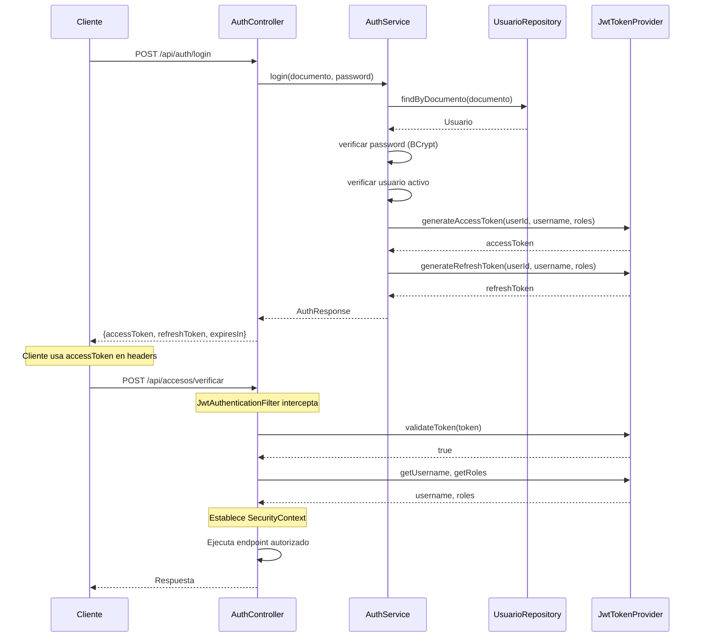
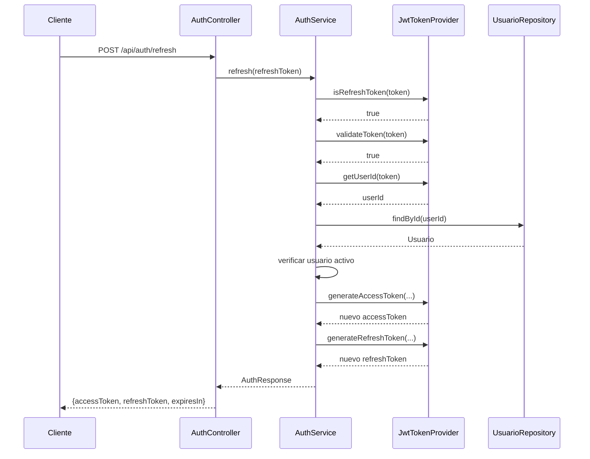

# FASE 4.1: Autenticación con JWT

**Fecha de implementación:** 27 de octubre de 2025  
**Estado:** ✅ Completado

## Objetivo

Implementar un sistema de autenticación basado en tokens JWT (JSON Web Tokens) para el backend de EduFeed, permitiendo un flujo seguro de login, logout y renovación de tokens.

## Componentes Implementados

### 1. Proveedor de Tokens JWT (`JwtTokenProvider`)

**Ubicación:** `edufeed-backend/src/main/java/co/cellano/edufeed/backend/security/JwtTokenProvider.java`

**Responsabilidades:**
- Generación de tokens de acceso y refresco
- Validación de tokens JWT
- Extracción de claims (usuario, roles, userId)
- Verificación de tipo de token (access/refresh)

**Características técnicas:**
- Algoritmo: HS256 (HMAC-SHA256)
- Librería: `io.jsonwebtoken` (jjwt) v0.12.5
- Clave secreta: Base64 configurable vía properties
- Validez configurable:
  - Access token: 3600 segundos (1 hora)
  - Refresh token: 604800 segundos (7 días)

**Claims personalizados:**
```json
{
  "userId": "uuid-del-usuario",
  "roles": ["ROLE_OPERADOR_ACCESO", "ROLE_USER"],
  "type": "access" // o "refresh"
}
```

### 2. Filtro de Autenticación JWT (`JwtAuthenticationFilter`)

**Ubicación:** `edufeed-backend/src/main/java/co/cellano/edufeed/backend/security/JwtAuthenticationFilter.java`

**Responsabilidades:**
- Interceptar todas las peticiones HTTP
- Extraer el token JWT del header `Authorization`
- Validar el token y establecer el contexto de seguridad
- Propagar la autenticación a través de `SecurityContextHolder`

**Funcionamiento:**
1. Lee el header `Authorization: Bearer <token>`
2. Extrae el token (substring después de "Bearer ")
3. Valida el token con `JwtTokenProvider`
4. Crea un `UsernamePasswordAuthenticationToken` con username y authorities
5. Lo registra en `SecurityContextHolder`

### 3. Controlador de Autenticación (`AuthController`)

**Ubicación:** `edufeed-backend/src/main/java/co/cellano/edufeed/backend/controller/AuthController.java`

**Endpoints implementados:**

#### POST `/api/auth/login`
- **Descripción:** Autentica un usuario con documento y contraseña
- **Request:**
  ```json
  {
    "documento": "1234567890",
    "password": "password123"
  }
  ```
- **Response (200 OK):**
  ```json
  {
    "accessToken": "eyJhbGc...",
    "refreshToken": "eyJhbGc...",
    "expiresIn": 3600
  }
  ```
- **Errores:**
  - 401 Unauthorized: Credenciales inválidas
  - 403 Forbidden: Usuario inactivo

#### POST `/api/auth/refresh`
- **Descripción:** Renueva el access token usando un refresh token válido
- **Request:**
  ```json
  {
    "refreshToken": "eyJhbGc..."
  }
  ```
- **Response (200 OK):**
  ```json
  {
    "accessToken": "eyJhbGc...",
    "refreshToken": "eyJhbGc...",
    "expiresIn": 3600
  }
  ```
- **Errores:**
  - 400 Bad Request: Token no es de tipo refresh
  - 401 Unauthorized: Token inválido o expirado

#### POST `/api/auth/logout`
- **Descripción:** Invalida la sesión actual (por ahora solo devuelve 204)
- **Headers requeridos:** `Authorization: Bearer <token>`
- **Response:** 204 No Content
- **Nota:** Implementación básica, no invalida el token en servidor (stateless)

### 4. Servicio de Autenticación (`AuthService`)

**Ubicación:** `edufeed-backend/src/main/java/co/cellano/edufeed/backend/service/AuthService.java`

**Responsabilidades:**
- Verificar credenciales del usuario
- Validar estado activo del usuario
- Generar pares de tokens (access + refresh)
- Renovar tokens usando refresh token

**Lógica de login:**
1. Busca usuario por documento
2. Verifica contraseña con BCrypt
3. Valida que el usuario esté activo
4. Extrae roles del usuario
5. Genera access token y refresh token
6. Retorna `AuthResponse` con ambos tokens

### 5. DTOs de Autenticación

**Ubicación:** `edufeed-backend/src/main/java/co/cellano/edufeed/backend/dto/request/` y `.../response/`

#### `LoginRequest`
```java
{
  String documento;      // @NotBlank
  String password;       // @NotBlank
}
```

#### `RefreshTokenRequest`
```java
{
  String refreshToken;   // @NotBlank
}
```

#### `AuthResponse`
```java
{
  String accessToken;
  String refreshToken;
  Long expiresIn;       // Segundos de validez del access token
}
```

### 6. Configuración de Seguridad (`SecurityConfig`)

**Ubicación:** `edufeed-backend/src/main/java/co/cellano/edufeed/backend/security/SecurityConfig.java`

**Configuraciones clave:**

```java
// Rutas públicas (sin autenticación requerida)
- /api/auth/**          (login, refresh, logout)
- /api/webauthn/**      (registro y autenticación biométrica)
- /swagger/**           (documentación Swagger UI)
- /swagger-ui/**
- /api-docs/**          (OpenAPI JSON)
- /v3/api-docs/**

// Configuración de sesión
- SessionCreationPolicy.STATELESS  // Sin sesiones HTTP

// Filtros
- JwtAuthenticationFilter se añade antes de UsernamePasswordAuthenticationFilter

// CORS
- Permitido desde cualquier origen (configurar en producción)

// Password encoder
- BCryptPasswordEncoder con strength 10
```

### 7. Propiedades de Configuración

**Ubicación:** `edufeed-backend/src/main/resources/application.yml`

```yaml
security:
  jwt:
    secret: ${JWT_SECRET:dGVzdC1zZWNyZXQta2V5LWZvci1kZXZlbG9wbWVudC1vbmx5LWNoYW5nZS1pbi1wcm9kdWN0aW9u}
    issuer: edufeed-backend
    accessTokenValiditySeconds: 3600      # 1 hora
    refreshTokenValiditySeconds: 604800   # 7 días
```

**⚠️ Importante:** La clave secreta por defecto es solo para desarrollo. En producción debe configurarse vía variable de entorno `JWT_SECRET`.

## Dependencias Añadidas

```xml
<!-- JWT (io.jsonwebtoken) -->
<dependency>
    <groupId>io.jsonwebtoken</groupId>
    <artifactId>jjwt-api</artifactId>
    <version>0.12.5</version>
</dependency>
<dependency>
    <groupId>io.jsonwebtoken</groupId>
    <artifactId>jjwt-impl</artifactId>
    <version>0.12.5</version>
    <scope>runtime</scope>
</dependency>
<dependency>
    <groupId>io.jsonwebtoken</groupId>
    <artifactId>jjwt-jackson</artifactId>
    <version>0.12.5</version>
    <scope>runtime</scope>
</dependency>
```

## Tests Implementados

### `JwtTokenProviderTest`

**Ubicación:** `edufeed-backend/src/test/java/co/cellano/edufeed/backend/security/JwtTokenProviderTest.java`

**Casos de prueba:**
- ✅ `generateAccessToken_valid()` - Genera token de acceso válido
- ✅ `generateRefreshToken_valid()` - Genera token de refresco válido
- ✅ `validateToken_validToken_returnsTrue()` - Valida token correcto
- ✅ `validateToken_invalidToken_returnsFalse()` - Rechaza token inválido
- ✅ `validateToken_expiredToken_returnsFalse()` - Rechaza token expirado
- ✅ `getUsername_validToken_returnsUsername()` - Extrae username correctamente
- ✅ `getUserId_validToken_returnsUserId()` - Extrae userId correctamente
- ✅ `getRoles_validToken_returnsRoles()` - Extrae lista de roles
- ✅ `isRefreshToken_accessToken_returnsFalse()` - Identifica token de acceso
- ✅ `isRefreshToken_refreshToken_returnsTrue()` - Identifica token de refresco

**Resultado:** 10/10 tests pasando ✅

### `AuthControllerTest`

**Ubicación:** `edufeed-backend/src/test/java/co/cellano/edufeed/backend/security/AuthControllerTest.java`

**Casos de prueba:**
- ✅ `login_validCredentials_returnsTokens()` - Login exitoso con credenciales válidas
- ✅ `login_invalidCredentials_returns401()` - Login fallido con credenciales incorrectas
- ✅ `refresh_validRefreshToken_returnsNewTokens()` - Renovación exitosa con refresh token válido
- ✅ `refresh_invalidToken_returns401()` - Renovación fallida con token inválido
- ✅ `logout_authenticated_returns204()` - Logout exitoso con usuario autenticado

**Resultado:** 5/5 tests pasando ✅

## Flujo de Autenticación



## Flujo de Renovación de Token



## Validaciones y Seguridad

### Validaciones Implementadas

1. **Login:**
   - Documento y password son obligatorios (`@NotBlank`)
   - Usuario debe existir en BD
   - Password debe coincidir (BCrypt)
   - Usuario debe estar activo (`usuario.activo == true`)

2. **Refresh:**
   - Token es obligatorio (`@NotBlank`)
   - Token debe ser de tipo "refresh"
   - Token debe ser válido (no expirado, firma correcta)
   - Usuario asociado debe existir
   - Usuario debe seguir activo

3. **Logout:**
   - Requiere token de autenticación válido en header
   - Usuario debe estar autenticado

### Medidas de Seguridad

- ✅ Contraseñas hasheadas con BCrypt (strength 10)
- ✅ Tokens firmados con HMAC-SHA256
- ✅ Validación de firma en cada request
- ✅ Validación de expiración de tokens
- ✅ Verificación de estado activo del usuario
- ✅ Separación de tokens de acceso y refresco
- ✅ Stateless (sin sesiones en servidor)
- ✅ CORS configurado (ajustar en producción)
- ⚠️ Secret key en properties (usar variable de entorno en producción)

## Manejo de Errores

### Excepciones Personalizadas

**`InvalidCredentialsException`**
- Se lanza cuando: documento no existe o password incorrecto
- HTTP Status: 401 Unauthorized
- Mensaje: "Credenciales inválidas"

**`InvalidTokenException`**
- Se lanza cuando: token inválido, expirado o no es refresh token
- HTTP Status: 401 Unauthorized
- Mensaje: "Token inválido"

**`UserNotActiveException`**
- Se lanza cuando: usuario existe pero está inactivo
- HTTP Status: 403 Forbidden
- Mensaje: "Usuario inactivo"

### Respuestas de Error

Todas las excepciones son manejadas por `GlobalExceptionHandler` y retornan:

```json
{
  "timestamp": "2025-10-27T18:30:00.000-05:00",
  "status": 401,
  "error": "Unauthorized",
  "message": "Credenciales inválidas",
  "path": "/api/auth/login",
  "traceId": "550e8400-e29b-41d4-a716-446655440000"
}
```

## Integración con OpenAPI/Swagger

Todos los endpoints de autenticación están documentados en Swagger:

- **URL:** http://localhost:8080/swagger
- **OpenAPI JSON:** http://localhost:8080/api-docs

**Ejemplo de anotaciones:**
```java
@Operation(summary = "Autenticar usuario", 
           description = "Autentica un usuario con documento y contraseña...")
@ApiResponses({
    @ApiResponse(responseCode = "200", description = "Autenticación exitosa"),
    @ApiResponse(responseCode = "401", description = "Credenciales inválidas"),
    @ApiResponse(responseCode = "403", description = "Usuario inactivo")
})
```

## Configuración de Entorno

### Variables de Entorno Recomendadas

```bash
# Desarrollo
JWT_SECRET=dGVzdC1zZWNyZXQta2V5LWZvci1kZXZlbG9wbWVudC1vbmx5LWNoYW5nZS1pbi1wcm9kdWN0aW9u

# Producción (generar clave fuerte de 256+ bits)
JWT_SECRET=<base64-encoded-secret-key-min-256-bits>
```

### Generación de Secret Key Segura

```bash
# Linux/Mac
openssl rand -base64 64

# PowerShell
[Convert]::ToBase64String((1..64 | ForEach-Object { Get-Random -Maximum 256 }))
```

## Próximos Pasos y Mejoras Futuras

### Pendientes de Implementación

1. **Blacklist de Tokens:**
   - Implementar Redis/cache para invalidar tokens en logout
   - Almacenar tokens revocados hasta su expiración

2. **Refresh Token Rotation:**
   - Invalidar refresh token anterior al renovar
   - Detectar uso de refresh tokens comprometidos

3. **Rate Limiting:**
   - Limitar intentos de login por IP/usuario
   - Protección contra ataques de fuerza bruta

4. **Auditoría:**
   - Registrar intentos de login exitosos/fallidos
   - Log de renovaciones de token
   - Alertas de actividad sospechosa

5. **Multi-Factor Authentication (MFA):**
   - Integración con TOTP/SMS
   - Opcional para roles administrativos

### Mejoras de Seguridad

- [ ] Implementar token fingerprinting
- [ ] Validar User-Agent/IP en renovaciones
- [ ] Rotación automática de secret keys
- [ ] Configurar CORS estricto en producción
- [ ] Implementar Content Security Policy (CSP)
- [ ] Añadir headers de seguridad (HSTS, X-Frame-Options, etc.)

## Notas de Desarrollo

### Compatibilidad

- **Java:** 21+ (requerido por Spring Boot 3.3.7)
- **Spring Boot:** 3.3.7
- **Spring Security:** 6.1.x (incluido en Boot)
- **jjwt:** 0.12.5

### Problemas Conocidos y Soluciones

**Problema:** Tests fallan con Java 24 y Mockito
- **Causa:** Byte Buddy no soporta oficialmente Java 24
- **Solución:** Añadir `-Dnet.bytebuddy.experimental=true` en maven-surefire-plugin

**Problema:** OpenAPI devuelve 500
- **Causa:** Incompatibilidad entre Spring Boot 3.4.x y springdoc 2.6.0
- **Solución:** Downgrade a Spring Boot 3.3.7 (compatible con springdoc 2.6.0)

## Referencias

- [RFC 7519 - JSON Web Token (JWT)](https://tools.ietf.org/html/rfc7519)
- [jjwt Documentation](https://github.com/jwtk/jjwt)
- [Spring Security Reference](https://docs.spring.io/spring-security/reference/index.html)
- [OWASP JWT Cheat Sheet](https://cheatsheetseries.owasp.org/cheatsheets/JSON_Web_Token_for_Java_Cheat_Sheet.html)

---

**Documentado por:** GitHub Copilot  
**Fecha:** 27 de octubre de 2025  
**Versión:** 1.0
