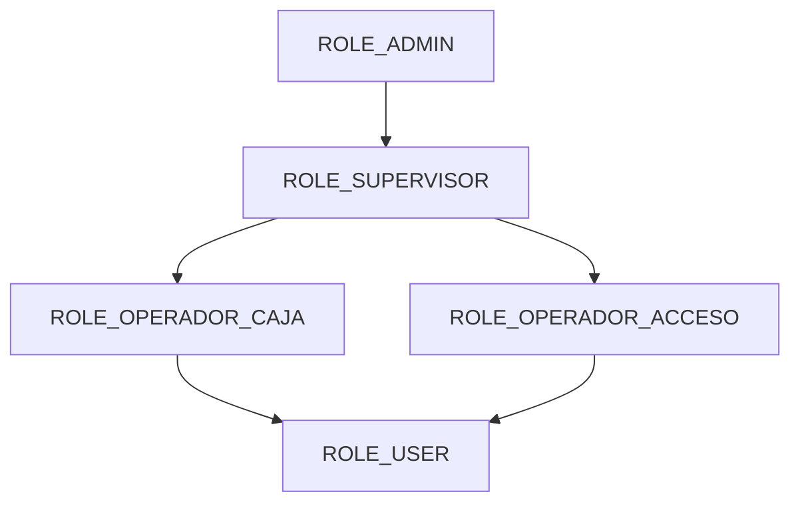
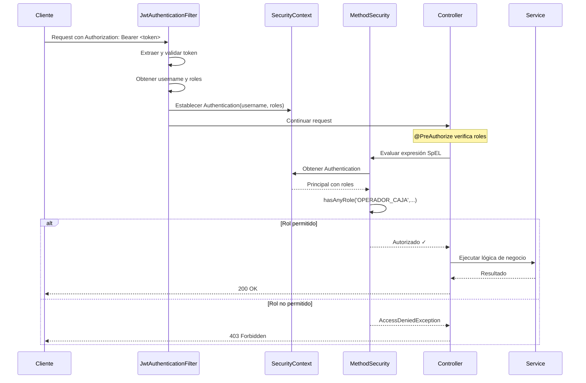

# FASE 4.2: Autorización por Roles

**Fecha de implementación:** 27 de octubre de 2025  
**Estado:** ✅ Completado

## Objetivo

Implementar un sistema de autorización basado en roles para controlar el acceso a diferentes endpoints del API según los permisos del usuario autenticado.

## Componentes Implementados

### 1. Modelo de Roles

**Ubicación:** `edufeed-backend/src/main/java/co/cellano/edufeed/backend/model/enums/Rol.java`

**Roles definidos:**

```java
public enum Rol {
    ROLE_USER,              // Usuario estándar (estudiante/profesor)
    ROLE_OPERADOR_ACCESO,   // Opera torniquetes de acceso
    ROLE_OPERADOR_CAJA,     // Gestiona pagos y recargas
    ROLE_SUPERVISOR,        // Supervisa operaciones
    ROLE_ADMIN              // Administrador del sistema
}
```

### 2. Jerarquía de Permisos



**Niveles de acceso:**

- **ROLE_USER:** Acceso básico (consultar saldo, historial propio)
- **ROLE_OPERADOR_ACCESO:** + Verificar accesos, registrar ingresos
- **ROLE_OPERADOR_CAJA:** + Aprobar pagos, recargar saldos
- **ROLE_SUPERVISOR:** + Consultar reportes, historial completo
- **ROLE_ADMIN:** Acceso total al sistema

### 3. Relación Usuario-Roles

**Ubicación:** `edufeed-backend/src/main/java/co/cellano/edufeed/backend/model/Usuario.java`

```java
@Entity
@Table(name = "usuario")
public class Usuario {
    // ... otros campos
    
    @ElementCollection(fetch = FetchType.EAGER)
    @CollectionTable(
        name = "usuario_rol",
        joinColumns = @JoinColumn(name = "usuario_id")
    )
    @Enumerated(EnumType.STRING)
    @Column(name = "rol")
    private Set<Rol> roles = new HashSet<>();
    
    // ...
}
```

**Migración de base de datos:**

```sql
-- V5__add_user_roles.sql
CREATE TABLE usuario_rol (
    usuario_id UUID NOT NULL,
    rol VARCHAR(50) NOT NULL,
    PRIMARY KEY (usuario_id, rol),
    CONSTRAINT fk_usuario_rol_usuario 
        FOREIGN KEY (usuario_id) 
        REFERENCES usuario(id)
);

-- Índice para mejorar consultas de roles
CREATE INDEX idx_usuario_rol_usuario_id ON usuario_rol(usuario_id);
```

### 4. Configuración de Method Security

**Ubicación:** `edufeed-backend/src/main/java/co/cellano/edufeed/backend/security/SecurityConfig.java`

```java
@Configuration
@EnableWebSecurity
@EnableMethodSecurity  // ← Habilita @PreAuthorize, @PostAuthorize, etc.
public class SecurityConfig {
    // ...
}
```

**Anotaciones disponibles:**
- `@PreAuthorize` - Evalúa antes de ejecutar el método
- `@PostAuthorize` - Evalúa después de ejecutar el método
- `@Secured` - Verificación simple de roles
- `@RolesAllowed` - JSR-250 estándar

### 5. Endpoints Protegidos

#### AccesoController

**POST `/api/accesos/verificar`**
```java
@PreAuthorize("hasAnyRole('OPERADOR_ACCESO','SUPERVISOR','ADMIN')")
public ResponseEntity<AccesoCheckResponse> verificarAcceso(
    @Valid @RequestBody AccesoCheckRequest request) {
    // ...
}
```
**Roles permitidos:** OPERADOR_ACCESO, SUPERVISOR, ADMIN

**GET `/api/accesos/historial`**
```java
@PreAuthorize("hasAnyRole('SUPERVISOR','ADMIN')")
public ResponseEntity<Page<AccesoDto>> obtenerHistorial(...) {
    // ...
}
```
**Roles permitidos:** SUPERVISOR, ADMIN

**GET `/api/accesos/usuario/{usuarioId}/dia`**
```java
@PreAuthorize("hasAnyRole('SUPERVISOR','ADMIN')")
public ResponseEntity<List<AccesoDto>> obtenerAccesosPorDia(
    @PathVariable("usuarioId") UUID usuarioId,
    @RequestParam @DateTimeFormat(iso = ISO.DATE_TIME) OffsetDateTime fecha) {
    // ...
}
```
**Roles permitidos:** SUPERVISOR, ADMIN

#### PagoController

**PUT `/api/pagos/{id}/aprobar`**
```java
@PreAuthorize("hasAnyRole('OPERADOR_CAJA','SUPERVISOR','ADMIN')")
public ResponseEntity<PagoDto> aprobar(@PathVariable UUID id) {
    // ...
}
```
**Roles permitidos:** OPERADOR_CAJA, SUPERVISOR, ADMIN

**PUT `/api/pagos/{id}/rechazar`**
```java
@PreAuthorize("hasAnyRole('OPERADOR_CAJA','SUPERVISOR','ADMIN')")
public ResponseEntity<PagoDto> rechazar(@PathVariable UUID id) {
    // ...
}
```
**Roles permitidos:** OPERADOR_CAJA, SUPERVISOR, ADMIN

#### UsuarioController

**POST `/api/usuarios`**
```java
@PreAuthorize("hasAnyRole('ADMIN')")
public ResponseEntity<UsuarioDto> crear(@Valid @RequestBody UsuarioDto dto) {
    // ...
}
```
**Roles permitidos:** ADMIN

**PUT `/api/usuarios/{id}`**
```java
@PreAuthorize("hasAnyRole('ADMIN','SUPERVISOR')")
public ResponseEntity<UsuarioDto> actualizar(
    @PathVariable UUID id,
    @Valid @RequestBody UsuarioDto dto) {
    // ...
}
```
**Roles permitidos:** ADMIN, SUPERVISOR

**DELETE `/api/usuarios/{id}`**
```java
@PreAuthorize("hasRole('ADMIN')")
public ResponseEntity<Void> eliminar(@PathVariable UUID id) {
    // ...
}
```
**Roles permitidos:** ADMIN

#### AuditoriaController

**GET `/api/auditorias`**
```java
@PreAuthorize("hasAnyRole('ADMIN','SUPERVISOR')")
public ResponseEntity<Page<AuditoriaDto>> listar(...) {
    // ...
}
```
**Roles permitidos:** ADMIN, SUPERVISOR

**GET `/api/auditorias/{id}`**
```java
@PreAuthorize("hasAnyRole('ADMIN','SUPERVISOR')")
public ResponseEntity<AuditoriaDto> obtener(@PathVariable("id") UUID id) {
    // ...
}
```
**Roles permitidos:** ADMIN, SUPERVISOR

### 6. Matriz de Permisos

| Endpoint | USER | OP_ACCESO | OP_CAJA | SUPERVISOR | ADMIN |
|----------|------|-----------|---------|------------|-------|
| POST /api/auth/login | ✅ | ✅ | ✅ | ✅ | ✅ |
| POST /api/auth/refresh | ✅ | ✅ | ✅ | ✅ | ✅ |
| POST /api/auth/logout | ✅ | ✅ | ✅ | ✅ | ✅ |
| POST /api/accesos/verificar | ❌ | ✅ | ❌ | ✅ | ✅ |
| GET /api/accesos/historial | ❌ | ❌ | ❌ | ✅ | ✅ |
| GET /api/accesos/usuario/{id}/dia | ❌ | ❌ | ❌ | ✅ | ✅ |
| PUT /api/pagos/{id}/aprobar | ❌ | ❌ | ✅ | ✅ | ✅ |
| PUT /api/pagos/{id}/rechazar | ❌ | ❌ | ✅ | ✅ | ✅ |
| POST /api/usuarios | ❌ | ❌ | ❌ | ❌ | ✅ |
| PUT /api/usuarios/{id} | ❌ | ❌ | ❌ | ✅ | ✅ |
| DELETE /api/usuarios/{id} | ❌ | ❌ | ❌ | ❌ | ✅ |
| GET /api/auditorias | ❌ | ❌ | ❌ | ✅ | ✅ |
| GET /api/auditorias/{id} | ❌ | ❌ | ❌ | ✅ | ✅ |

### 7. Manejo de Errores de Autorización

**`GlobalExceptionHandler`**

**Ubicación:** `edufeed-backend/src/main/java/co/cellano/edufeed/backend/exception/GlobalExceptionHandler.java`

```java
@ExceptionHandler(AccessDeniedException.class)
public ResponseEntity<ErrorResponse> handleAccessDenied(
    AccessDeniedException ex,
    WebRequest request) {
    
    log.warn("Acceso denegado: {}", ex.getMessage());
    
    ErrorResponse error = ErrorResponse.builder()
        .timestamp(OffsetDateTime.now(ZoneId.of("America/Bogota")))
        .status(HttpStatus.FORBIDDEN.value())
        .error(HttpStatus.FORBIDDEN.getReasonPhrase())
        .message("No tiene permisos para realizar esta acción")
        .path(getPath(request))
        .traceId(MDC.get("traceId"))
        .build();
    
    return ResponseEntity.status(HttpStatus.FORBIDDEN).body(error);
}

@ExceptionHandler(AuthenticationException.class)
public ResponseEntity<ErrorResponse> handleAuthentication(
    AuthenticationException ex,
    WebRequest request) {
    
    log.warn("Error de autenticación: {}", ex.getMessage());
    
    ErrorResponse error = ErrorResponse.builder()
        .timestamp(OffsetDateTime.now(ZoneId.of("America/Bogota")))
        .status(HttpStatus.UNAUTHORIZED.value())
        .error(HttpStatus.UNAUTHORIZED.getReasonPhrase())
        .message("Credenciales inválidas o token expirado")
        .path(getPath(request))
        .traceId(MDC.get("traceId"))
        .build();
    
    return ResponseEntity.status(HttpStatus.UNAUTHORIZED).body(error);
}
```

**Respuestas de error:**

**403 Forbidden - Sin permisos:**
```json
{
  "timestamp": "2025-10-27T18:30:00.000-05:00",
  "status": 403,
  "error": "Forbidden",
  "message": "No tiene permisos para realizar esta acción",
  "path": "/api/usuarios",
  "traceId": "550e8400-e29b-41d4-a716-446655440000"
}
```

**401 Unauthorized - Sin autenticación:**
```json
{
  "timestamp": "2025-10-27T18:30:00.000-05:00",
  "status": 401,
  "error": "Unauthorized",
  "message": "Credenciales inválidas o token expirado",
  "path": "/api/pagos/123/aprobar",
  "traceId": "550e8400-e29b-41d4-a716-446655440000"
}
```

## Tests Implementados

### `AuthorizationTest`

**Ubicación:** `edufeed-backend/src/test/java/co/cellano/edufeed/backend/security/AuthorizationTest.java`

**Configuración especial:**
```java
@WebMvcTest(
    value = {AccesoController.class, PagoController.class},
    excludeFilters = @ComponentScan.Filter(
        type = FilterType.ASSIGNABLE_TYPE,
        classes = {JwtAuthenticationFilter.class, 
                   JwtTokenProvider.class, 
                   SecurityConfig.class}
    )
)
@AutoConfigureMockMvc(addFilters = false)
class AuthorizationTest {
    
    @TestConfiguration
    @EnableMethodSecurity  // ← Habilita @PreAuthorize en tests
    static class MocksConfig {
        @Bean
        AccesoService accesoService() { 
            return Mockito.mock(AccesoService.class); 
        }
        @Bean
        PagoService pagoService() { 
            return Mockito.mock(PagoService.class); 
        }
    }
    // ...
}
```

**Casos de prueba:**

#### Test 1: Verificar Acceso - Forbidden sin rol
```java
@Test
@WithMockUser(roles = {"USER"})  // Solo ROLE_USER
void verificarAcceso_forbidden_without_role() throws Exception {
    Mockito.when(accesoService.verificarAcceso(any()))
        .thenReturn(AccesoCheckResponse.builder()
            .permitido(true)
            .motivo("OK")
            .build());

    mvc.perform(post("/api/accesos/verificar")
            .contentType(MediaType.APPLICATION_JSON)
            .content("{\"usuarioId\":\"" + UUID.randomUUID() + 
                     "\",\"modalidad\":\"HUELLA\"}"))
        .andExpect(status().isForbidden());  // ← 403
}
```

#### Test 2: Verificar Acceso - Permitido con rol
```java
@Test
@WithMockUser(roles = {"OPERADOR_ACCESO"})  // Rol requerido
void verificarAcceso_allowed_for_operador_acceso() throws Exception {
    Mockito.when(accesoService.verificarAcceso(any()))
        .thenReturn(AccesoCheckResponse.builder()
            .permitido(true)
            .motivo("OK")
            .build());

    mvc.perform(post("/api/accesos/verificar")
            .contentType(MediaType.APPLICATION_JSON)
            .content("{\"usuarioId\":\"" + UUID.randomUUID() + 
                     "\",\"modalidad\":\"HUELLA\"}"))
        .andExpect(status().isOk());  // ← 200
}
```

#### Test 3: Aprobar Pago - Forbidden sin rol
```java
@Test
@WithMockUser(roles = {"USER"})  // Solo ROLE_USER
void aprobarPago_forbidden_without_role() throws Exception {
    Mockito.when(pagoService.aprobar(any(UUID.class)))
        .thenReturn(new PagoDto());

    mvc.perform(put("/api/pagos/" + UUID.randomUUID() + "/aprobar"))
        .andExpect(status().isForbidden());  // ← 403
}
```

#### Test 4: Aprobar Pago - Permitido con rol
```java
@Test
@WithMockUser(roles = {"OPERADOR_CAJA"})  // Rol requerido
void aprobarPago_allowed_for_operador_caja() throws Exception {
    Mockito.when(pagoService.aprobar(any(UUID.class)))
        .thenReturn(new PagoDto());

    mvc.perform(put("/api/pagos/" + UUID.randomUUID() + "/aprobar"))
        .andExpect(status().isOk());  // ← 200
}
```

**Resultado:** 4/4 tests pasando ✅

### Estrategia de Testing

1. **Mock de servicios:** Los tests no requieren base de datos real
2. **@WithMockUser:** Simula usuario autenticado con roles específicos
3. **addFilters = false:** Desactiva filtros de seguridad para aislar pruebas
4. **@EnableMethodSecurity:** Necesario para que `@PreAuthorize` funcione en tests
5. **excludeFilters:** Excluye componentes de seguridad para evitar dependencias no necesarias

## Seed de Datos de Prueba

**Ubicación:** `scripts/seed/EduFeed_seed.sql`

**Usuarios de prueba creados:**

```sql
-- Admin (todos los permisos)
INSERT INTO usuario_rol (usuario_id, rol) 
SELECT id, 'ROLE_ADMIN' FROM usuario WHERE documento = '1000000001';

-- Supervisor (reportes, gestión)
INSERT INTO usuario_rol (usuario_id, rol) 
SELECT id, 'ROLE_SUPERVISOR' FROM usuario WHERE documento = '1000000002';

-- Operador de Acceso (torniquetes)
INSERT INTO usuario_rol (usuario_id, rol) 
SELECT id, 'ROLE_OPERADOR_ACCESO' FROM usuario WHERE documento = '1000000003';

-- Operador de Caja (pagos)
INSERT INTO usuario_rol (usuario_id, rol) 
SELECT id, 'ROLE_OPERADOR_CAJA' FROM usuario WHERE documento = '1000000004';

-- Usuario estándar (estudiante)
INSERT INTO usuario_rol (usuario_id, rol) 
SELECT id, 'ROLE_USER' FROM usuario WHERE documento = '1010101010';
```

**Nota:** Todos los usuarios tienen contraseña `password123` (hasheada con BCrypt).

## Flujo de Autorización



## Expresiones SpEL Soportadas

### Verificación de Roles

```java
// Un rol específico
@PreAuthorize("hasRole('ADMIN')")

// Múltiples roles (cualquiera)
@PreAuthorize("hasAnyRole('ADMIN','SUPERVISOR')")

// Todos los roles (todos)
@PreAuthorize("hasAllRoles('ADMIN','SUPERVISOR')")
```

### Verificación de Authorities

```java
// Authority específica
@PreAuthorize("hasAuthority('ROLE_ADMIN')")

// Múltiples authorities
@PreAuthorize("hasAnyAuthority('ROLE_ADMIN','ROLE_SUPERVISOR')")
```

### Expresiones Complejas

```java
// AND lógico
@PreAuthorize("hasRole('ADMIN') and #userId == principal.userId")

// OR lógico
@PreAuthorize("hasRole('ADMIN') or #userId == principal.userId")

// Acceso a parámetros del método
@PreAuthorize("#dto.userId == principal.userId")

// Acceso a propiedades del usuario autenticado
@PreAuthorize("principal.username == 'admin'")
```

### Validaciones Post-Ejecución

```java
// Verificar resultado del método
@PostAuthorize("returnObject.userId == principal.userId")

// Filtrar colecciones
@PostFilter("filterObject.userId == principal.userId")

// Filtrar parámetros
@PreFilter("filterObject.userId == principal.userId")
```

## Integración con JWT

### Claims de Roles en Token

Los roles se incluyen en el JWT como claim personalizado:

```json
{
  "sub": "admin@edufeed.com",
  "userId": "550e8400-e29b-41d4-a716-446655440000",
  "roles": [
    "ROLE_ADMIN",
    "ROLE_USER"
  ],
  "type": "access",
  "iat": 1698441600,
  "exp": 1698445200,
  "iss": "edufeed-backend"
}
```

### Extracción de Roles

**JwtTokenProvider:**
```java
public List<String> getRoles(String token) {
    Object roles = getAllClaims(token).get("roles");
    if (roles instanceof List<?> list) {
        return list.stream()
            .map(Object::toString)
            .toList();
    }
    return List.of();
}
```

**JwtAuthenticationFilter:**
```java
List<SimpleGrantedAuthority> authorities = tokenProvider.getRoles(token)
    .stream()
    .map(SimpleGrantedAuthority::new)
    .toList();

UsernamePasswordAuthenticationToken authentication =
    new UsernamePasswordAuthenticationToken(username, null, authorities);
```

## Problemas Resueltos y Soluciones

### Problema 1: Tests fallaban con Java 24

**Error:**
```
java.lang.IllegalArgumentException: Java 24 (68) is not supported by 
the current version of Byte Buddy which officially supports Java 23 (67)
```

**Solución:**
```xml
<!-- pom.xml -->
<plugin>
    <groupId>org.apache.maven.plugins</groupId>
    <artifactId>maven-surefire-plugin</artifactId>
    <version>3.5.1</version>
    <configuration>
        <systemPropertyVariables>
            <net.bytebuddy.experimental>true</net.bytebuddy.experimental>
        </systemPropertyVariables>
    </configuration>
</plugin>
```

### Problema 2: ApplicationContext no cargaba en tests

**Error:**
```
No qualifying bean of type 'JwtTokenProvider' available
```

**Solución:**
Excluir componentes de seguridad no necesarios en el slice de test:

```java
@WebMvcTest(
    value = {AccesoController.class, PagoController.class},
    excludeFilters = @ComponentScan.Filter(
        type = FilterType.ASSIGNABLE_TYPE,
        classes = {JwtAuthenticationFilter.class, 
                   JwtTokenProvider.class, 
                   SecurityConfig.class}
    )
)
```

### Problema 3: @PreAuthorize no funcionaba en tests

**Error:**
```
Expected 403 but got 200
```

**Solución:**
Añadir `@EnableMethodSecurity` en la configuración de test:

```java
@TestConfiguration
@EnableMethodSecurity  // ← Esencial para @PreAuthorize
static class MocksConfig {
    // ...
}
```

### Problema 4: @PathVariable sin nombre explícito

**Error:**
```
Name for argument of type [java.util.UUID] not specified, and parameter 
name information not available via reflection
```

**Solución:**
Especificar nombre explícito en todas las anotaciones:

```java
// Antes
@PathVariable UUID usuarioId

// Después
@PathVariable("usuarioId") UUID usuarioId
```

## Mejores Prácticas Implementadas

### 1. Principio de Menor Privilegio
- Cada rol tiene solo los permisos estrictamente necesarios
- ROLE_USER es el rol base para todos los usuarios
- Permisos administrativos solo para ADMIN

### 2. Separación de Responsabilidades
- Operadores de acceso ≠ Operadores de caja
- Cada rol tiene un dominio específico
- Supervisores pueden auditar pero no modificar

### 3. Defensa en Profundidad
- Validación en múltiples capas:
  1. Filtro de autenticación (token válido)
  2. Method Security (roles correctos)
  3. Lógica de negocio (reglas adicionales)

### 4. Auditoría
- Todos los accesos denegados se registran en logs
- TraceId permite seguimiento de requests
- Timestamps en zona horaria de Bogotá

### 5. Testing Exhaustivo
- Tests para cada combinación rol/endpoint
- Casos positivos y negativos
- Verificación de respuestas HTTP correctas

## Documentación OpenAPI

Todos los endpoints protegidos incluyen documentación de seguridad:

```java
@Operation(
    summary = "Verificar derecho de acceso",
    description = "Verifica si un usuario tiene derecho vigente...",
    security = @SecurityRequirement(name = "bearerAuth")
)
@ApiResponses({
    @ApiResponse(responseCode = "200", description = "Verificación exitosa"),
    @ApiResponse(responseCode = "401", description = "No autenticado"),
    @ApiResponse(responseCode = "403", description = "Sin permisos"),
    @ApiResponse(responseCode = "404", description = "Usuario no encontrado")
})
```

**Configuración de seguridad en OpenAPI:**

```java
@Configuration
public class OpenApiConfig {
    @Bean
    public OpenAPI customOpenAPI() {
        return new OpenAPI()
            .components(new Components()
                .addSecuritySchemes("bearerAuth",
                    new SecurityScheme()
                        .type(SecurityScheme.Type.HTTP)
                        .scheme("bearer")
                        .bearerFormat("JWT")));
    }
}
```

## Próximos Pasos y Mejoras Futuras

### Pendientes de Implementación

1. **Permisos Granulares:**
   - Definir permisos específicos más allá de roles
   - Ej: `PAGO:APROBAR`, `ACCESO:VERIFICAR`
   - Combinar roles con permisos

2. **Autorización Basada en Datos:**
   - Verificar propiedad de recursos
   - Ej: Usuario solo puede ver sus propios pagos
   - Implementar `@PostAuthorize` con expresiones

3. **Roles Dinámicos:**
   - Permitir creación de roles personalizados
   - Asignación de permisos por interfaz
   - Tabla `permiso` y `rol_permiso`

4. **Multi-Tenancy:**
   - Roles por institución/sede
   - Aislamiento de datos entre tenants
   - ROLE_ADMIN limitado a su tenant

5. **Delegación de Permisos:**
   - Permitir que supervisores deleguen permisos temporales
   - Implementar roles con fecha de expiración
   - Log de cambios de permisos

### Mejoras de Seguridad

- [ ] Implementar rate limiting por rol
- [ ] Auditar cambios de roles
- [ ] Alertas de escalada de privilegios
- [ ] Revisar permisos periódicamente
- [ ] Implementar approval workflow para ADMIN

## Referencias

- [Spring Security Method Security](https://docs.spring.io/spring-security/reference/servlet/authorization/method-security.html)
- [Spring Expression Language (SpEL)](https://docs.spring.io/spring-framework/reference/core/expressions.html)
- [OWASP Access Control Cheat Sheet](https://cheatsheetseries.owasp.org/cheatsheets/Authorization_Cheat_Sheet.html)
- [RBAC - Role-Based Access Control](https://en.wikipedia.org/wiki/Role-based_access_control)

---

**Documentado por:** GitHub Copilot  
**Fecha:** 27 de octubre de 2025  
**Versión:** 1.0
