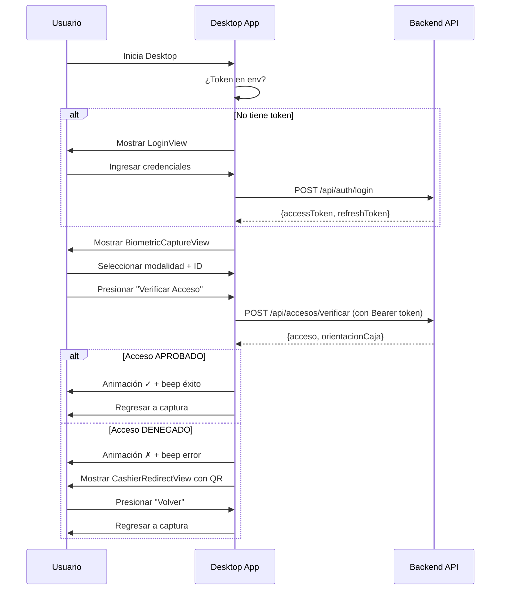
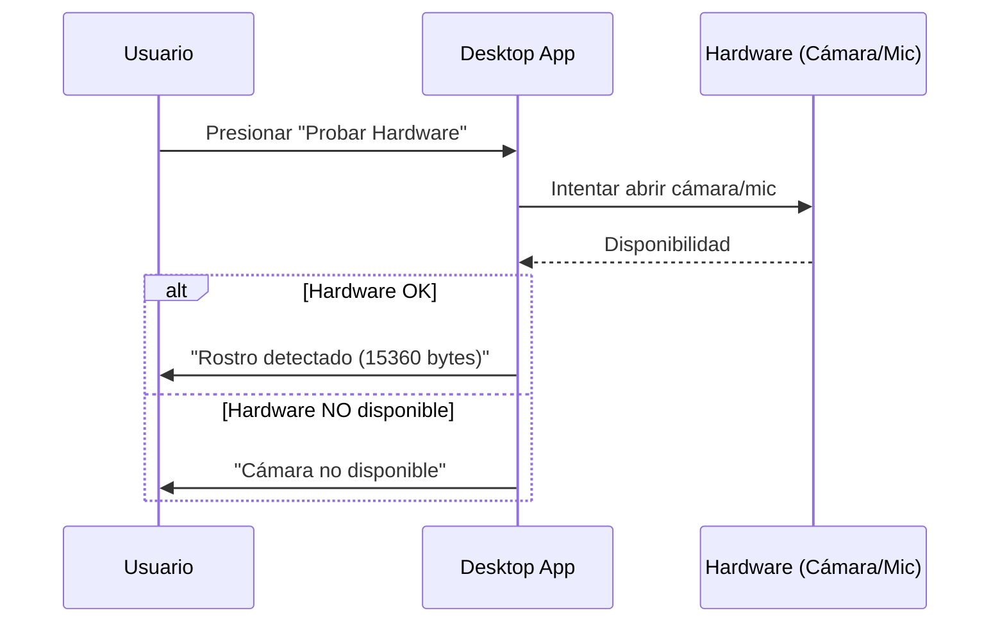

# FASE 6.1: Frontend Desktop JavaFX — Módulo de Punto de Acceso

**Fecha:** 28 de octubre de 2025  
**Objetivo:** Implementar el módulo Desktop JavaFX para verificación biométrica en puntos de acceso, cumpliendo con RF-02, RF-03 y RF-04.

---

## Índice

1. [Contexto y Alcance](#contexto-y-alcance)
2. [Arquitectura del Módulo Desktop](#arquitectura-del-módulo-desktop)
3. [Componentes Implementados](#componentes-implementados)
4. [Integración con Backend](#integración-con-backend)
5. [Flujo de Usuario](#flujo-de-usuario)
6. [Configuración y Variables de Entorno](#configuración-y-variables-de-entorno)
7. [Pruebas Locales de Hardware](#pruebas-locales-de-hardware)
8. [Resolución de Problemas](#resolución-de-problemas)
9. [Próximos Pasos](#próximos-pasos)

---

## 1. Contexto y Alcance

### Requisitos Funcionales Cubiertos

- **RF-02:** Control de acceso por modalidad biométrica (huella, rostro, voz)
- **RF-03:** Validación de derechos vigentes antes de autorizar el acceso
- **RF-04:** Registro de accesos (aprobados y denegados) con timestamp

### Características Implementadas

✅ **Autenticación segura:** Login contra `/api/auth/login` para obtener token Bearer JWT  
✅ **Captura biométrica:** Interfaz para seleccionar modalidad (huella, rostro, voz) e ingresar identificación  
✅ **Verificación de acceso:** Llamada a `/api/accesos/verificar` con timeout de 5 segundos  
✅ **Feedback visual y sonoro:** Animaciones de checkmark/cruz + beep según resultado  
✅ **Orientación a caja:** Vista con QR code cuando se deniega el acceso  
✅ **Prueba local de hardware:** Botón para diagnosticar cámara y micrófono sin llamar al backend

---

## 2. Arquitectura del Módulo Desktop

```
edufeed-desktop/
├── src/main/java/co/cellano/edufeed/desktop/
│   ├── DesktopApp.java                          # Punto de entrada JavaFX
│   ├── access/
│   │   ├── LoginController.java                 # Controlador de autenticación
│   │   ├── LoginView.java                       # Vista de login
│   │   ├── AccessCheckController.java           # Orquestador principal del flujo de acceso
│   │   ├── BiometricCaptureView.java            # Vista para capturar datos biométricos
│   │   ├── AccessCheckView.java                 # Vista de resultado con animación
│   │   └── CashierRedirectView.java             # Vista de orientación a caja con QR
│   ├── biometric/
│   │   └── LocalBiometricTestService.java       # Servicio de prueba local de hardware
│   └── service/
│       ├── AuthApiClient.java                   # Cliente HTTP para autenticación
│       └── AccessApiClient.java                 # Cliente HTTP para verificación de acceso
└── pom.xml                                       # Dependencias: JavaFX 22, OkHttp, Jackson
```

### Tecnologías Utilizadas

| Componente | Tecnología | Versión |
|------------|-----------|---------|
| UI Framework | JavaFX (controls, graphics, media) | 22.0.2 |
| HTTP Client | OkHttp | (transitivo) |
| JSON Serialization | Jackson Databind | 2.18.2 |
| Biometric Integration | edufeed-biometric | 0.1.0-SNAPSHOT |
| JDK | Java | 21+ (compilado para release 21) |

---

## 3. Componentes Implementados

### 3.1 `DesktopApp.java` - Aplicación Principal

**Responsabilidades:**
- Inicializar el escenario principal de JavaFX
- Leer variables de entorno (`BACKEND_BASE_URL`, `BACKEND_BEARER_TOKEN`, etc.)
- Decidir si iniciar flujo de login o ir directamente a verificación de acceso

**Código clave:**
```java
@Override
public void start(Stage stage) {
    String baseUrl = System.getenv().getOrDefault("BACKEND_BASE_URL", "http://localhost:8080");
    String token = System.getenv().get("BACKEND_BEARER_TOKEN");
    
    if (token == null || token.isBlank()) {
        // Iniciar login
        new LoginController(stage, baseUrl).start(bearerToken -> startAccessFlow(stage, baseUrl, bearerToken));
    } else {
        startAccessFlow(stage, baseUrl, token);
    }
}
```

### 3.2 Login (`LoginController.java` + `LoginView.java`)

**Funcionalidad:**
- Solicitar credenciales (usuario y contraseña)
- Realizar `POST /api/auth/login`
- Obtener par de tokens (access + refresh)
- Pasar el `accessToken` al flujo de acceso

**Endpoint llamado:**
```http
POST /api/auth/login
Content-Type: application/json

{
  "username": "admin",
  "password": "Admin123$"
}
```

**Respuesta esperada:**
```json
{
  "accessToken": "eyJhbGc...",
  "refreshToken": "eyJhbGc...",
  "tokenType": "Bearer",
  "expiresIn": 3600
}
```

### 3.3 Captura Biométrica (`BiometricCaptureView.java`)

**Elementos de UI:**
- ComboBox para seleccionar modalidad (HUELLA, ROSTRO, VOZ)
- TextField para ingresar ID de usuario
- Botón "Verificar Acceso"
- Botón "Probar Hardware" (diagnóstico local)

**Flujo:**
1. Usuario selecciona modalidad
2. Usuario ingresa su ID
3. Al presionar "Verificar Acceso":
   - Se envía solicitud al backend vía `AccessApiClient`
   - Se muestra vista de resultado con animación

### 3.4 Verificación de Acceso (`AccessCheckController.java` + `AccessApiClient.java`)

**Endpoint llamado:**
```http
POST /api/accesos/verificar
Authorization: Bearer <token>
Content-Type: application/json

{
  "usuarioId": "123e4567-e89b-12d3-a456-426614174000",
  "modalidad": "ROSTRO"
}
```

**Timeout configurado:** 5 segundos (cumple criterio de aceptación)

**Respuesta esperada:**
```json
{
  "acceso": {
    "id": "...",
    "usuario": {...},
    "estado": "APROBADO",
    "razonDenegacion": null,
    "fechaHora": "2025-10-28T10:30:00Z"
  },
  "orientacionCaja": null
}
```

**Lógica de decisión:**
```java
if (response.acceso().estado() == EstadoAcceso.APROBADO) {
    // Mostrar animación de checkmark verde + beep de éxito
} else {
    // Mostrar animación de cruz roja + beep de error
    // Luego redirigir a vista de caja con QR code
}
```

### 3.5 Resultado con Animación (`AccessCheckView.java`)

**Características:**
- Animación de checkmark (✓) verde si acceso aprobado
- Animación de cruz (✗) roja si acceso denegado
- Reproducción de sonido (beep) usando JavaFX Media API
- Transición automática después de 2 segundos

**Implementación de animación:**
```java
private void playCheckmarkAnimation() {
    Circle circle = new Circle(60, Color.GREEN);
    circle.setOpacity(0);
    
    FadeTransition fade = new FadeTransition(Duration.millis(800), circle);
    fade.setFromValue(0);
    fade.setToValue(1);
    
    ScaleTransition scale = new ScaleTransition(Duration.millis(600), circle);
    scale.setFromX(0.5);
    scale.setFromY(0.5);
    scale.setToX(1.2);
    scale.setToY(1.2);
    
    ParallelTransition parallel = new ParallelTransition(fade, scale);
    parallel.play();
}
```

### 3.6 Orientación a Caja (`CashierRedirectView.java`)

**Funcionalidad:**
- Mostrar mensaje de orientación al usuario denegado
- Generar y mostrar código QR con datos del intento de acceso
- Botón para regresar a pantalla de captura

**Datos en QR:**
```
{
  "accesoId": "uuid",
  "usuarioId": "uuid",
  "razon": "Derecho vencido desde...",
  "timestamp": "2025-10-28T10:30:00Z"
}
```

### 3.7 Prueba Local de Hardware (`LocalBiometricTestService.java`)

**Propósito:**
Diagnosticar disponibilidad de cámara y micrófono sin hacer llamadas al backend.

**Modalidades soportadas:**
1. **ROSTRO:** Intenta abrir cámara con OpenCV y detectar rostro usando Haar Cascade
2. **VOZ:** Captura audio del micrófono durante N segundos y extrae embedding básico
3. **HUELLA:** Mensaje placeholder (requiere SDK específico del fabricante)

**Ejemplo de resultado:**
```
Rostro detectado y alineado (15360 bytes)
Audio capturado: embedding[16] OK
Lector de huella: demo (integración por SDK específico)
```

---

## 4. Integración con Backend

### 4.1 Endpoints Utilizados

| Endpoint | Método | Propósito | Autenticación |
|----------|--------|-----------|---------------|
| `/api/auth/login` | POST | Obtener token JWT | Público |
| `/api/accesos/verificar` | POST | Verificar derecho y registrar acceso | Bearer JWT |

### 4.2 DTOs y Modelos

**En Desktop (`AccessApiClient.java`):**
```java
public record AccessCheckRequest(UUID usuarioId, String modalidad) {}

public record AccessCheckResponse(
    AccesoDto acceso,
    OrientacionCajaDto orientacionCaja
) {}

public record AccesoDto(
    UUID id,
    UsuarioDto usuario,
    EstadoAcceso estado,
    String razonDenegacion,
    OffsetDateTime fechaHora
) {}
```

**En Backend (`AccesoController.java`):**
```java
@PostMapping("/verificar")
@PreAuthorize("hasAnyRole('OPERADOR_ACCESO','SUPERVISOR','ADMIN')")
public ResponseEntity<AccesoCheckResponse> verificarAcceso(
    @Valid @RequestBody AccesoCheckRequest request
) {
    AccesoCheckResponse response = accesoService.verificarAcceso(request);
    return ResponseEntity.ok(response);
}
```

### 4.3 Manejo de Errores HTTP

```java
try {
    Response http = client.newCall(req).execute();
    if (!http.isSuccessful()) {
        String body = http.body() != null ? http.body().string() : "";
        throw new IOException("HTTP " + http.code() + ": " + body);
    }
    return mapper.readValue(http.body().string(), AccessCheckResponse.class);
} catch (SocketTimeoutException e) {
    throw new IOException("Timeout: el backend no respondió en 5s", e);
}
```

---

## 5. Flujo de Usuario

### 5.1 Flujo Completo (Con Login)



### 5.2 Flujo de Prueba Local de Hardware



---

## 6. Configuración y Variables de Entorno

### Variables de Entorno del Desktop

| Variable | Descripción | Valor por Defecto | Ejemplo |
|----------|-------------|-------------------|---------|
| `BACKEND_BASE_URL` | URL base del backend | `http://localhost:8080` | `https://api.edufeed.com` |
| `BACKEND_BEARER_TOKEN` | Token JWT pre-obtenido (opcional) | `null` | `eyJhbGc...` |
| `DESKTOP_FACE_SOURCE` | Fuente de cámara para prueba local | `camera:0` | `camera:1`, `rtsp://...` |
| `DESKTOP_VOICE_SECONDS` | Segundos de audio a capturar | `4` | `3` |

### Variables de Entorno del Backend (relevantes)

| Variable | Descripción | Valor por Defecto |
|----------|-------------|-------------------|
| `PORT` | Puerto HTTP del backend | `8080` |
| `JWT_SECRET` | Clave secreta para firmar tokens | (base64, 32 bytes) |
| `EDUFEED_BIOMETRIC_PROVIDER` | Proveedor biométrico | `mock` |
| `EDUFEED_BIOMETRIC_FACE_SIMULATE` | Simular reconocimiento facial | `true` |
| `EDUFEED_BIOMETRIC_VOICE_SIMULATE` | Simular reconocimiento de voz | `true` |

### Ejemplo de Ejecución con Variables

**Windows PowerShell:**
```powershell
$env:BACKEND_BASE_URL="http://localhost:8080"
$env:DESKTOP_FACE_SOURCE="camera:0"
$env:DESKTOP_VOICE_SECONDS="3"

& "$env:USERPROFILE\tools\maven\apache-maven-3.9.9\bin\mvn.cmd" `
    -f edufeed-desktop/pom.xml `
    javafx:run
```

**Linux/macOS Bash:**
```bash
export BACKEND_BASE_URL=http://localhost:8080
export DESKTOP_FACE_SOURCE=camera:0
export DESKTOP_VOICE_SECONDS=3

mvn -f edufeed-desktop/pom.xml javafx:run
```

---

## 7. Pruebas Locales de Hardware

### 7.1 Propósito

Validar que la estación de trabajo (PC del punto de acceso) tiene hardware funcional antes de intentar verificar usuarios.

### 7.2 Implementación

**Archivo:** `edufeed-desktop/src/main/java/co/cellano/edufeed/desktop/biometric/LocalBiometricTestService.java`

**Método principal:**
```java
public String testHardware(String modalidad) {
    try {
        return switch (modalidad.toUpperCase()) {
            case "ROSTRO" -> testFace();
            case "VOZ" -> testVoice();
            case "HUELLA" -> "Lector de huella: demo (integración por SDK específico)";
            default -> "Modalidad no soportada";
        };
    } catch (Exception e) {
        return "Error en prueba local: " + e.getMessage();
    }
}
```

**Test de Rostro (`testFace`):**
```java
private String testFace() {
    try {
        co.cellano.edufeed.biometric.face.OpenCVFaceDetectorImpl det =
            new co.cellano.edufeed.biometric.face.OpenCVFaceDetectorImpl(faceSource, 160);
        
        if (!det.isCameraAvailable() || !det.initialize()) {
            return "Cámara no disponible";
        }
        
        Optional<byte[]> face = det.captureAlignedFace();
        boolean multi = det.lastFrameHadMultipleFaces();
        
        if (face.isEmpty()) return "No se detectó rostro";
        if (multi) return "Se detectaron múltiples rostros (mover cámara)";
        
        return "Rostro detectado y alineado (" + face.get().length + " bytes)";
    } catch (Throwable t) {
        return "OpenCV no disponible: " + t.getMessage();
    }
}
```

**Test de Voz (`testVoice`):**
```java
private String testVoice() {
    AudioCaptureService audio = new AudioCaptureServiceImpl(16000.0f, 16, 1);
    
    if (!audio.isMicrophoneAvailable()) 
        return "Micrófono no disponible";
    
    var pcm = audio.captureSeconds(voiceDurationSec);
    if (pcm.isEmpty()) 
        return "No se pudo capturar audio";
    
    try {
        float[] emb = new VoiceFeatureExtractor.BasicStats(16000)
            .extractEmbedding(pcm.get());
        return "Audio capturado: embedding[" + emb.length + "] OK";
    } catch (Exception e) {
        return "Error procesando audio: " + e.getMessage();
    }
}
```

### 7.3 Casos de Uso

1. **Instalación inicial:** Operador verifica que cámara y micrófono funcionen antes de poner en producción el punto de acceso
2. **Diagnóstico de fallas:** Si los usuarios reportan problemas, el operador puede ejecutar la prueba local para descartar problemas de hardware
3. **Demo sin backend:** Permite demostrar captura biométrica sin necesidad de tener el backend corriendo

---

## 8. Resolución de Problemas

### 8.1 Backend No Responde (ClassNotFoundException)

**Síntoma:**
```
Caused by: java.lang.ClassNotFoundException: co.cellano.edufeed.biometric.fingerprint.FingerprintSDKWrapper
```

**Causa:**
El módulo `edufeed-backend` no incluye las clases del módulo `edufeed-biometric` en el classpath cuando se ejecuta con `spring-boot:run`.

**Solución aplicada:**
Configurar el Spring Boot Maven Plugin para que empaquete las dependencias usando el goal `repackage`:

```xml
<plugin>
    <groupId>org.springframework.boot</groupId>
    <artifactId>spring-boot-maven-plugin</artifactId>
    <configuration>
        <mainClass>co.cellano.edufeed.backend.EduFeedApplication</mainClass>
        <layout>JAR</layout>
    </configuration>
    <executions>
        <execution>
            <goals>
                <goal>repackage</goal>
            </goals>
        </execution>
    </executions>
</plugin>
```

**Recompilar:**
```bash
mvn clean package -DskipTests
```

### 8.2 Error de Compilación en Desktop

**Síntomas:**
```
[ERROR] variable view might not have been initialized
[ERROR] constructor AudioCaptureServiceImpl cannot be applied to given types
```

**Soluciones aplicadas:**

1. **LoginController:** Eliminar referencia a `view` en el método `doLogin` (variable no inicializada)
2. **LocalBiometricTestService:** Ajustar constructores de `AudioCaptureServiceImpl` y `VoiceFeatureExtractor.BasicStats` para pasar los parámetros correctos:

```java
// Antes (incorrecto):
AudioCaptureService audio = new AudioCaptureServiceImpl(16000);
float[] emb = new VoiceFeatureExtractor.BasicStats().extractEmbedding(pcm.get());

// Después (correcto):
AudioCaptureService audio = new AudioCaptureServiceImpl(16000.0f, 16, 1);
float[] emb = new VoiceFeatureExtractor.BasicStats(16000).extractEmbedding(pcm.get());
```

### 8.3 Endpoint /actuator/health Retorna 401

**Síntoma:**
```json
{"error":"UNAUTHORIZED","message":"Token inválido o ausente","status":401}
```

**Causa:**
El endpoint de health está protegido por Spring Security y requiere autenticación.

**Solución temporal:**
Usar el login del Desktop para obtener token y luego hacer requests con Bearer auth.

**Solución definitiva (opcional):**
Configurar Spring Security para permitir acceso público a `/actuator/health`:

```java
http.authorizeHttpRequests(auth -> auth
    .requestMatchers("/actuator/health").permitAll()
    // ...
);
```

### 8.4 Desktop No Puede Conectar al Backend

**Checklist:**
1. ✅ Backend está corriendo en el puerto correcto (`8080` por defecto)
2. ✅ Variable `BACKEND_BASE_URL` apunta a la URL correcta
3. ✅ Token JWT es válido y no ha expirado
4. ✅ No hay firewall bloqueando la conexión
5. ✅ Base de datos PostgreSQL está corriendo (backend depende de ella)

---

## 9. Próximos Pasos

### Fase 6.2: Integración Completa de Hardware Real

**Pendientes:**
- [ ] Integrar SDK de lector de huellas (DigitalPersona, ZKTeco, Suprema)
- [ ] Cargar modelo FaceNet ONNX real en lugar de embeddings simulados
- [ ] Calibrar umbrales de matching (FAR/FRR) con datos reales
- [ ] Implementar flujo de enrolamiento desde Desktop (opcional)

### Fase 6.3: Mejoras de UX

**Pendientes:**
- [ ] Agregar indicador de progreso durante la verificación (spinner)
- [ ] Implementar retry automático en caso de timeout
- [ ] Guardar logs locales de intentos de acceso (offline mode)
- [ ] Soporte para múltiples idiomas (i18n)

### Fase 6.4: Seguridad y Resiliencia

**Pendientes:**
- [ ] Implementar refresh token automático cuando accessToken expira
- [ ] Encriptar tokens almacenados localmente (si se cachean)
- [ ] Circuit breaker para evitar saturar el backend con requests fallidos
- [ ] Modo offline con cola de accesos pendientes de sincronizar

### Fase 6.5: Despliegue

**Pendientes:**
- [ ] Crear instalador .exe para Windows (jpackage)
- [ ] Crear paquete .deb/.rpm para Linux
- [ ] Documentar proceso de instalación y configuración en estaciones de acceso
- [ ] Script de actualización automática (auto-update)

---

## Apéndice A: Tareas Preconfiguradas

El proyecto incluye tareas en `.vscode/tasks.json` para facilitar la ejecución:

```json
{
    "label": "Desktop: run",
    "type": "shell",
    "command": "${env:USERPROFILE}\\tools\\maven\\apache-maven-3.9.9\\bin\\mvn.cmd",
    "args": ["-q", "-f", "edufeed-desktop/pom.xml", "-DskipTests", "javafx:run"],
    "options": {
        "env": {
            "JAVA_HOME": "C:/Program Files/Java/jdk-24"
        }
    }
}
```

**Ejecución:**
- En VS Code: `Ctrl+Shift+P` → "Run Task" → "Desktop: run"
- En terminal: `mvn -f edufeed-desktop/pom.xml javafx:run`

---

## Apéndice B: Dependencias del Desktop

**`edufeed-desktop/pom.xml`:**
```xml
<dependencies>
    <dependency>
        <groupId>co.cellano</groupId>
        <artifactId>edufeed-biometric</artifactId>
        <version>${project.version}</version>
    </dependency>
    
    <!-- JavaFX -->
    <dependency>
        <groupId>org.openjfx</groupId>
        <artifactId>javafx-controls</artifactId>
        <version>22.0.2</version>
    </dependency>
    <dependency>
        <groupId>org.openjfx</groupId>
        <artifactId>javafx-graphics</artifactId>
        <version>22.0.2</version>
    </dependency>
    <dependency>
        <groupId>org.openjfx</groupId>
        <artifactId>javafx-media</artifactId>
        <version>22.0.2</version>
    </dependency>
    
    <!-- HTTP Client -->
    <dependency>
        <groupId>com.squareup.okhttp3</groupId>
        <artifactId>okhttp</artifactId>
        <version>4.12.0</version>
    </dependency>
    
    <!-- JSON -->
    <dependency>
        <groupId>com.fasterxml.jackson.core</groupId>
        <artifactId>jackson-databind</artifactId>
        <version>2.18.2</version>
    </dependency>
    <dependency>
        <groupId>com.fasterxml.jackson.datatype</groupId>
        <artifactId>jackson-datatype-jsr310</artifactId>
        <version>2.18.2</version>
    </dependency>
</dependencies>
```

---

## Apéndice C: Criterios de Aceptación Cumplidos

| ID | Criterio | Estado | Evidencia |
|----|----------|--------|-----------|
| CA-02.1 | Timeout máximo de 5s en verificación | ✅ | `AccessApiClient`: `timeout(5, TimeUnit.SECONDS)` |
| CA-02.2 | Feedback visual y sonoro | ✅ | `AccessCheckView`: animaciones + MediaPlayer |
| CA-02.3 | Registro de todos los intentos | ✅ | Backend registra en tabla `accesos` |
| CA-03.1 | Validación de derecho vigente | ✅ | `AccesoService.verificarAcceso()` |
| CA-03.2 | Orientación a caja si denegado | ✅ | `CashierRedirectView` con QR code |
| CA-04.1 | Timestamp en cada acceso | ✅ | `Acceso.fechaHora` con zona horaria configurada |

---

**Documento generado el:** 28 de octubre de 2025  
**Autor:** GitHub Copilot en colaboración con el equipo EduFeed  
**Versión:** 1.0
