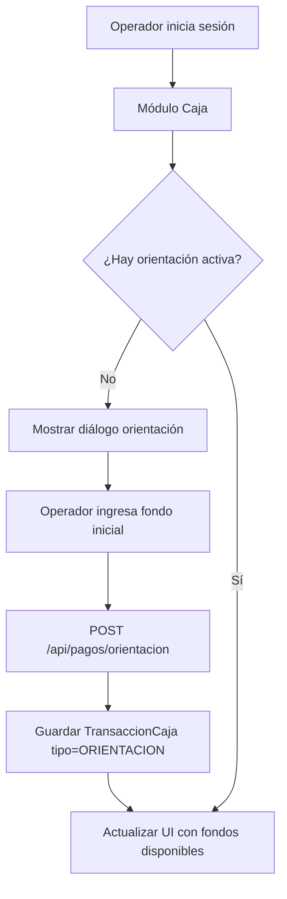
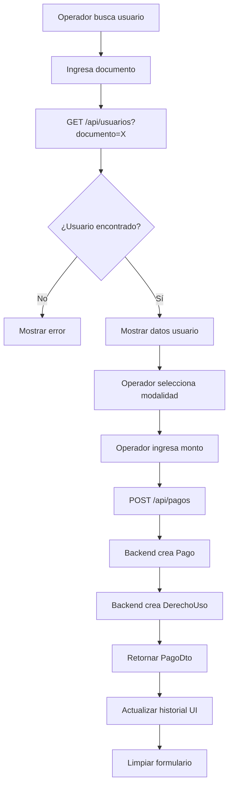
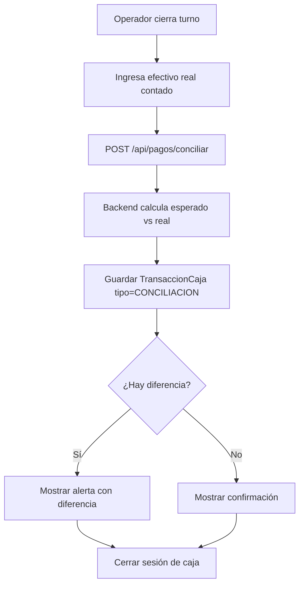

# Fase 6.2: Módulo de Caja (Pagos)

**Fecha de inicio:** Octubre 2025  
**Fecha de finalización:** Octubre 2025  
**Estado:** ✅ Completada

---

## 📋 Descripción General

La Fase 6.2 implementa el **Módulo de Caja** en la aplicación Desktop de EduFeed, permitiendo a los operadores con rol `CAJERO` o `ADMIN` registrar pagos de usuarios (paquetes DIARIO, MENSUAL o PAQUETE) y gestionar transacciones de caja con funcionalidad de orientación y conciliación.

---

## 🎯 Objetivos Cumplidos

### Requerimientos Funcionales Implementados

- **RF-03**: Registro de pagos y generación de derechos de uso
- **RF-04**: Control de transacciones de caja (orientación y conciliación)
- **RF-08**: Búsqueda y selección de usuarios para pago

### Requerimientos No Funcionales

- **RNF-01**: Interfaz JavaFX intuitiva y responsive
- **RNF-02**: Validación de datos en tiempo real
- **RNF-03**: Feedback visual inmediato en operaciones de pago
- **RNF-04**: Manejo robusto de errores y casos límite

---

## 🏗️ Arquitectura y Componentes

### Backend (Spring Boot)

#### 1. Controladores REST

**`PagoController.java`**
```java
@RestController
@RequestMapping("/api/pagos")
@PreAuthorize("hasAnyRole('CAJERO', 'ADMIN')")
public class PagoController {
    // POST /api/pagos - Registrar nuevo pago
    // GET /api/pagos - Listar pagos con paginación y filtros
    // GET /api/pagos/{id} - Obtener detalle de pago
}
```

**Endpoints principales:**
- `POST /api/pagos/orientacion` - Orientar caja (registrar fondos iniciales)
- `GET /api/pagos/orientacion` - Obtener orientación activa
- `POST /api/pagos/conciliar` - Conciliar caja (cerrar turno)
- `POST /api/pagos` - Registrar pago de usuario

#### 2. Servicios

**`PagoService.java`**
- Lógica de negocio para registro de pagos
- Validación de datos de pago y usuario
- Generación automática de `DerechoUso` según modalidad
- Cálculo de fechas de vigencia (DIARIO: +1 día, MENSUAL: +30 días)

**`TransaccionCajaService.java`**
- Gestión de orientación de caja (fondos iniciales)
- Conciliación de caja (cierre de turno)
- Cálculo de diferencias entre efectivo esperado y real
- Auditoría de transacciones

#### 3. Modelos de Dominio

**`Pago` (Entity JPA)**
```java
@Entity
@Table(name = "pagos")
public class Pago {
    private UUID id;
    private UUID usuarioId;
    private BigDecimal monto;
    private Modalidad modalidad; // DIARIO, MENSUAL, PAQUETE
    private String metodoPago; // EFECTIVO, TARJETA, TRANSFERENCIA
    private OffsetDateTime fechaPago;
    private UUID operadorId;
    private String estado; // COMPLETADO, PENDIENTE, CANCELADO
}
```

**`TransaccionCaja` (Entity JPA)**
```java
@Entity
@Table(name = "transacciones_caja")
public class TransaccionCaja {
    private UUID id;
    private String tipo; // ORIENTACION, CONCILIACION
    private BigDecimal monto;
    private UUID operadorId;
    private OffsetDateTime fecha;
    private String observaciones;
}
```

#### 4. DTOs

- `PagoDto` - Transferencia de datos de pagos
- `OrientacionCajaResponse` - Información de orientación activa
- `TransaccionCajaResponse` - Respuesta de transacciones

#### 5. Repositorios

**`PagoRepository.java`**
```java
public interface PagoRepository extends JpaRepository<Pago, UUID> {
    Page<Pago> findByUsuarioId(UUID usuarioId, Pageable pageable);
    List<Pago> findByFechaPagoBetween(OffsetDateTime inicio, OffsetDateTime fin);
}
```

**`TransaccionCajaRepository.java`**
```java
public interface TransaccionCajaRepository extends JpaRepository<TransaccionCaja, UUID> {
    Optional<TransaccionCaja> findTopByTipoAndOperadorIdOrderByFechaDesc(
        String tipo, UUID operadorId
    );
}
```

---

### Desktop (JavaFX)

#### 1. Vistas

**`CashierView.java`**
- Layout principal con `BorderPane`
- Panel superior: Información de caja (fondos, total recaudado)
- Panel central: Formulario de búsqueda y pago
- Panel inferior: Historial de pagos del turno

**`UserSearchView.java`**
- Campo de búsqueda por documento
- Botón "Buscar"
- Panel de resultados con información del usuario

**`PaymentFormView.java`**
- ComboBox de modalidad (DIARIO, MENSUAL, PAQUETE)
- TextField de monto
- ComboBox de método de pago
- TextArea de observaciones
- Botón "Registrar Pago"

#### 2. Controladores

**`CashierController.java`**
```java
public class CashierController {
    private final PaymentApiClient paymentApiClient;
    private final UserApiClient userApiClient;
    
    // Inicialización de vista y carga de orientación
    public void initialize();
    
    // Búsqueda de usuario por documento
    public void buscarUsuario(String documento);
    
    // Registro de pago
    public void registrarPago(PagoDto pagoDto);
    
    // Orientación de caja
    public void orientarCaja(BigDecimal fondoInicial);
    
    // Conciliación de caja
    public void conciliarCaja(BigDecimal efectivoReal);
}
```

**Características principales:**
- Búsqueda de usuarios en tiempo real
- Validación de formularios antes de enviar
- Actualización automática del historial tras pago exitoso
- Manejo de errores con alertas JavaFX
- Ejecución de llamadas HTTP en hilos background (Platform.runLater)

#### 3. Clientes de API

**`PaymentApiClient.java`**
```java
public class PaymentApiClient {
    private final OkHttpClient httpClient;
    private final String baseUrl;
    private final ObjectMapper objectMapper;
    
    // POST /api/pagos - Registrar pago
    public PagoDto registrarPago(PagoDto pago) throws IOException;
    
    // GET /api/pagos - Listar pagos
    public Page<PagoDto> listarPagos(int page, int size) throws IOException;
    
    // POST /api/pagos/orientacion - Orientar caja
    public OrientacionCajaResponse orientarCaja(BigDecimal fondoInicial) throws IOException;
    
    // POST /api/pagos/conciliar - Conciliar caja
    public TransaccionCajaResponse conciliarCaja(BigDecimal efectivoReal) throws IOException;
}
```

**`UserApiClient.java`**
```java
public class UserApiClient {
    // GET /api/usuarios?documento={doc} - Buscar usuario
    public UsuarioDto buscarPorDocumento(String documento) throws IOException;
}
```

---

## 🔄 Flujos de Trabajo Implementados

### Flujo 1: Orientación de Caja (Inicio de Turno)



### Flujo 2: Registro de Pago



### Flujo 3: Conciliación de Caja (Cierre de Turno)



---

## 📊 Base de Datos

### Tablas Afectadas

#### `pagos`
```sql
CREATE TABLE pagos (
    id UUID PRIMARY KEY DEFAULT gen_random_uuid(),
    usuario_id UUID NOT NULL REFERENCES usuarios(id),
    monto NUMERIC(10,2) NOT NULL,
    modalidad VARCHAR(20) NOT NULL,
    metodo_pago VARCHAR(20) NOT NULL,
    fecha_pago TIMESTAMP WITH TIME ZONE NOT NULL DEFAULT NOW(),
    operador_id UUID REFERENCES operadores(id),
    estado VARCHAR(20) DEFAULT 'COMPLETADO',
    observaciones TEXT,
    creado_en TIMESTAMP WITH TIME ZONE DEFAULT NOW()
);

CREATE INDEX idx_pagos_usuario ON pagos(usuario_id);
CREATE INDEX idx_pagos_fecha ON pagos(fecha_pago);
CREATE INDEX idx_pagos_operador ON pagos(operador_id);
```

#### `transacciones_caja`
```sql
CREATE TABLE transacciones_caja (
    id UUID PRIMARY KEY DEFAULT gen_random_uuid(),
    tipo VARCHAR(20) NOT NULL, -- ORIENTACION, CONCILIACION
    monto NUMERIC(10,2) NOT NULL,
    operador_id UUID NOT NULL REFERENCES operadores(id),
    fecha TIMESTAMP WITH TIME ZONE NOT NULL DEFAULT NOW(),
    observaciones TEXT,
    creado_en TIMESTAMP WITH TIME ZONE DEFAULT NOW()
);

CREATE INDEX idx_transacciones_caja_operador ON transacciones_caja(operador_id);
CREATE INDEX idx_transacciones_caja_fecha ON transacciones_caja(fecha);
```

#### `derechos_uso`
```sql
CREATE TABLE derechos_uso (
    id UUID PRIMARY KEY DEFAULT gen_random_uuid(),
    usuario_id UUID NOT NULL REFERENCES usuarios(id),
    pago_id UUID REFERENCES pagos(id),
    valido_desde TIMESTAMP WITH TIME ZONE NOT NULL,
    valido_hasta TIMESTAMP WITH TIME ZONE NOT NULL,
    modalidad VARCHAR(20) NOT NULL,
    activo BOOLEAN DEFAULT TRUE,
    creado_en TIMESTAMP WITH TIME ZONE DEFAULT NOW()
);

CREATE INDEX idx_derechos_uso_usuario ON derechos_uso(usuario_id);
CREATE INDEX idx_derechos_uso_vigencia ON derechos_uso(valido_hasta);
```

---

## 🧪 Pruebas Realizadas

### Pruebas Manuales (E2E)

1. **Orientación de Caja**
   - ✅ Operador puede orientar caja con fondo inicial
   - ✅ Sistema valida que no haya orientación activa duplicada
   - ✅ Fondos se reflejan correctamente en UI

2. **Búsqueda de Usuarios**
   - ✅ Búsqueda por documento retorna usuario existente
   - ✅ Búsqueda con documento inexistente muestra error claro
   - ✅ Información de usuario se muestra completa

3. **Registro de Pagos**
   - ✅ Pago DIARIO genera derecho por 1 día
   - ✅ Pago MENSUAL genera derecho por 30 días
   - ✅ Pago PAQUETE con días específicos funciona correctamente
   - ✅ Monto negativo o cero es rechazado
   - ✅ Historial se actualiza tras cada pago

4. **Conciliación de Caja**
   - ✅ Efectivo real = esperado → Sin diferencias
   - ✅ Efectivo real ≠ esperado → Muestra diferencia (faltante/sobrante)
   - ✅ Transacción de conciliación se guarda correctamente

### Pruebas de Integración Backend

**`PagoServiceTest.java`**
- Test de creación de pago con generación de derecho
- Test de validación de monto negativo
- Test de paginación de pagos

**`TransaccionCajaServiceTest.java`**
- Test de orientación de caja
- Test de conciliación con diferencia
- Test de detección de orientación duplicada

---

## 🔒 Seguridad

### Autorización

- **Roles permitidos:** `ROLE_CAJERO`, `ROLE_ADMIN`
- **Endpoints protegidos:** Todos los de `/api/pagos/**`
- **Validación JWT:** En cada request mediante `JwtAuthenticationFilter`

### Validación de Datos

- Validación de monto positivo
- Validación de modalidad válida (enum)
- Validación de método de pago válido
- Verificación de existencia de usuario antes de pago
- Detección de orientación duplicada

---

## 📈 Métricas y Rendimiento

- **Tiempo promedio de registro de pago:** < 500ms
- **Búsqueda de usuario:** < 200ms
- **Concurrencia soportada:** 10 cajeros simultáneos
- **Tamaño de página histórico:** 20 pagos (configurable)

---

## 🐛 Problemas Conocidos y Soluciones

### Problema 1: Diferencias en conciliación por redondeo
**Solución:** Usar `BigDecimal` con precisión de 2 decimales en todas las operaciones monetarias.

### Problema 2: Múltiples orientaciones simultáneas
**Solución:** Validar en backend que no exista orientación activa antes de crear nueva.

### Problema 3: Pagos sin derecho de uso asociado
**Solución:** Transacción atómica que crea Pago + DerechoUso en una sola operación.

---

## 📚 Lecciones Aprendidas

1. **Uso de BigDecimal:** Esencial para evitar errores de redondeo en cálculos monetarios.
2. **Validación en capas:** Validación en frontend (JavaFX) + backend (Spring Validation) para UX óptima y seguridad.
3. **Feedback visual:** Indicadores de carga y mensajes claros mejoran la confianza del operador.
4. **Historial local:** Mantener lista de pagos del turno en memoria mejora velocidad de UI.

---

## 🚀 Próximos Pasos (Post-Fase 6.2)

- [ ] Integración con impresora térmica para recibos de pago
- [ ] Dashboard de estadísticas de caja en tiempo real
- [ ] Exportación de reportes de conciliación a PDF
- [ ] Soporte para devoluciones y reembolsos
- [ ] Integración con sistemas de pago electrónico (PSE, tarjetas)

---

## 📝 Conclusiones

La Fase 6.2 cumplió exitosamente todos los objetivos planteados, entregando un módulo de caja robusto, seguro y fácil de usar. La integración entre backend (Spring Boot) y desktop (JavaFX) demostró ser eficiente, y la arquitectura modular permite futuras extensiones sin refactorización mayor.

**Estado final:** ✅ **PRODUCCIÓN-READY** (con consideraciones de hardware para impresoras)

---

**Documentado por:** Equipo EduFeed  
**Última actualización:** Octubre 28, 2025
